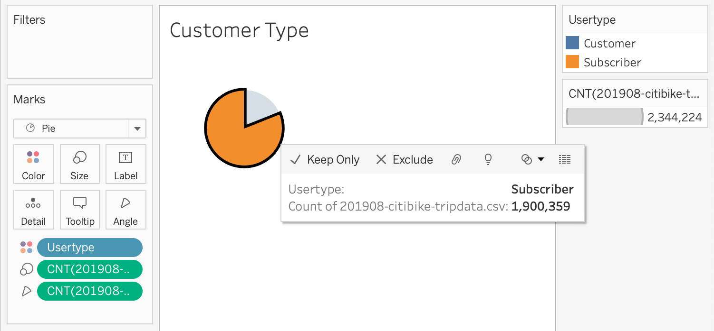
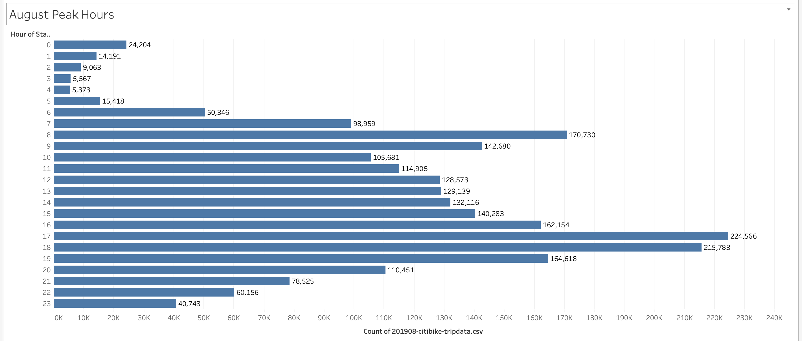
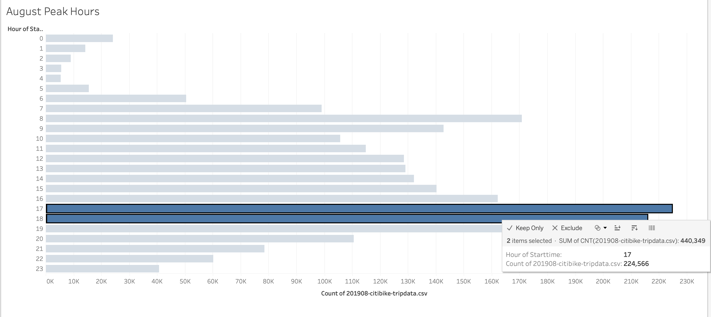
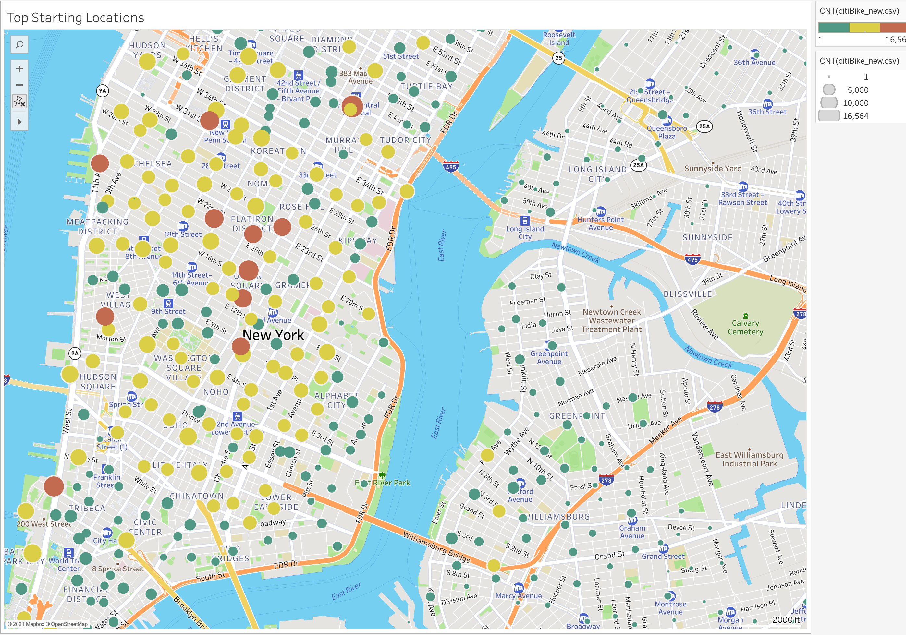
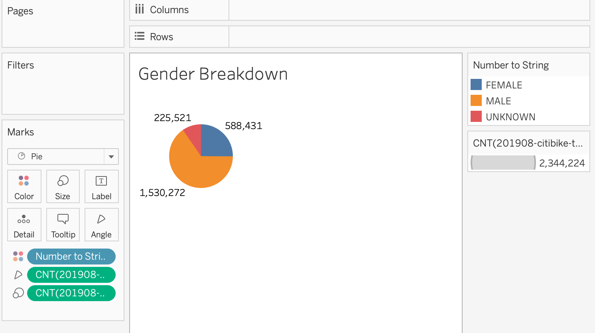
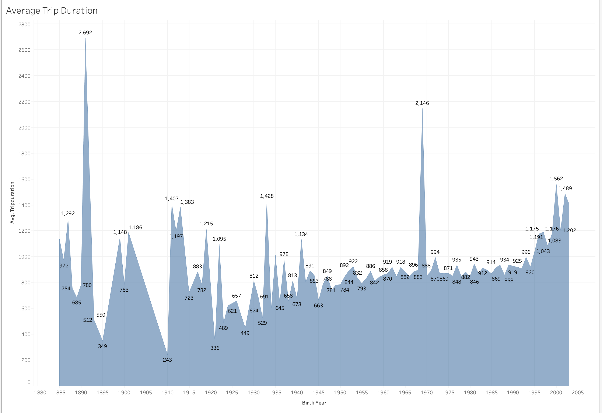
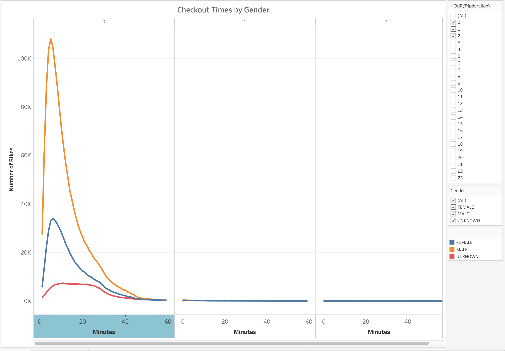
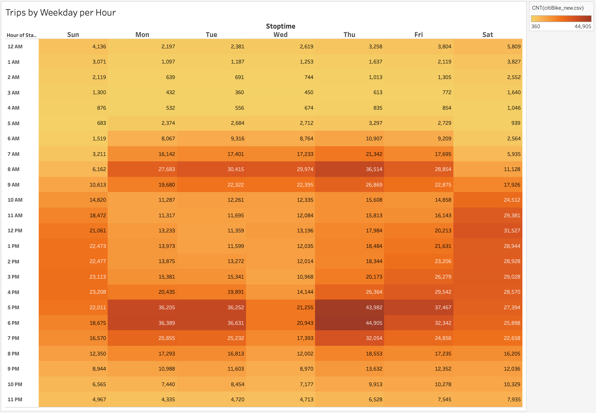
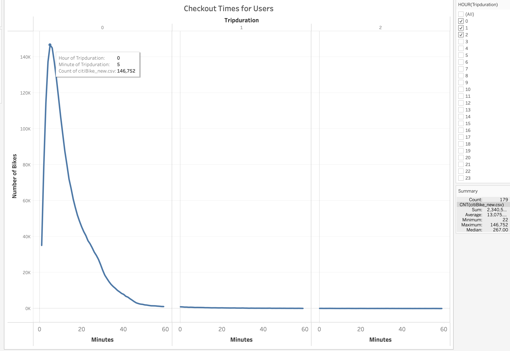

# Bikesharing

## Overview

The purpose of this analysis was to present a business proposal to help predict if a bike-sharing company idea, similar to the bike-sharing program in New York City(NYC), could work in Des Moines, IA. To conduct the analysis and create effective visualizations, a CSV titled "Citi Bike Data" was imported into Tableau. 

Once the data was imported, a few modifications were made so that the data was represented accurately when viewed. For example, the "Tripduration" column was changed from an integer to datetime datatype and the "Gender" column was converted from integer to string (Male, Female, Unknown).

The primary goal when using Tableau is to answer questions using data. The data from the month of August was chosen for the analysis due to the high- traffic activity during the summer months. Using the data from the month August as a starting point, the following questions were asked during the analysis process:

- How many rides could be expected in Des Moines
- What was the proportion of short-term customers to annual subscribers
- What was the ballpark estimate of number of bikes needed for the program
- What were the most popular locations for starting and ending bike rides 
- What was the number of active riders by gender
- What was the average trip duration by age

To portray the answers accurately,  worksheets, dashboards, and stories were created in Tableau, and based off the NYC bike-sharing dataset. 

## Results

The analysis showed the following:

#### There were 2,344,224 trips recorded in the month of August 

#### There were 1,900,359 subscribers and 443,865 short-term customers

#### August peak hours were between 5pm to 7pm

#### Over 200,000 riders used the service during peak hours

#### Tourist hots spots were the top locations for start/end bike stations

#### There were 1,530,272 male riders compared to 588,431 females

#### In general, younger riders had the longest ride duration

## Summary

According to the data, and the analysis performed, indicates that the bike-sharing business in NYC is very successful. The most active times for riders was at 8am, and 5pm-7pm. The top and ending locations were mainly concentrated in tourist areas, which are also the high-traffic areas. However, only 19% of total riders were short-term customers. The assumption is that the 81% of subscribers were residents of NYC. 

It is interesting to note that the majority of riders were men. Also, females tend to ride the most during the early hours of the day, while male riders rode more in the evening hours. The "Checkout Times for Users" chart showed that a whopping 146,752 riders rode for only 5 minutes. This may indicate that these riders were using the bikes to commute to short distance places in order to avoid all forms of public transportation. Further, Thursdays, between 5pm to 7pm, seemed to be the most popular day of the week to take a bike ride. 

After thorough analysis, it is strongly believed that a bike-sharing program will work in Des Moines, IA, and also in any state in the country. Society is increasingly concerned with climate change, fossil fuels, and air pollution. Therefore, these type of programs, which are climate friendly, would be welcomed and used by many. 

Two additional visualizations suggested for this analysis that may further convince investors interested in this program would include the following:

- Visualizations showing the bike-ride data for the winter months
- Visualizations showing distance of rural areas and bike stations

#### Male riders vs. Female riders

#### Popular days of the week (Thur)

#### Riders 5min trips

[link to dashboard](https://public.tableau.com/profile/jacqueline.esbri#!/vizhome/Book2_16215297860780/NYCStory?publish=yes "link to dashboard")
